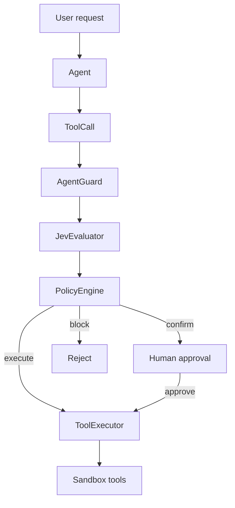

# AgentGuard

**AI Agent Safety Gateway** — an engineering experiment that evaluates AI-generated tool calls *before* they execute.

AgentGuard sits between an agent’s proposed tool call and tool execution. It uses [Jev](https://jevtypesafeai.com) for typed decision signals, then applies a **deterministic application policy** to choose:

`EXECUTE` · `REQUIRE CONFIRMATION` · `BLOCK`

> Portfolio experiment — not a production security product.  
> Jev provides signals. AgentGuard owns the final **policy decision**. Tools stay sandboxed.

---

## Try it

```bash
uv sync
cp .env.example .env   # optional: set JEV_API_KEY for live Jev
uv run streamlit run app/main.py
```

| Route | What you get |
| --- | --- |
| `/` | Landing — problem, Jev primitives, architecture, outcomes, limitations |
| `/playground` | Interactive console — live Agent → Jev → Policy → tool path |

The landing page does **not** initialize the Jev client. The playground does, on first visit.

Production deploy (Docker → DigitalOcean → Nginx): see [`DEPLOYMENT.md`](DEPLOYMENT.md).

```bash
uv run pytest
uv run ruff check .
```

---

## Why it exists

Tool-calling agents can plan useful actions, but tools have consequences: reads, writes, deletes, external side effects. Free-form model prose is a weak control boundary.

AgentGuard explores a control plane between:

1. “The agent wants to do this.”
2. “The system decides whether it should.”

---

## How it works

```text
User → Agent → Proposed Tool Call → AgentGuard
                                      ↓
                              Jev (choice · score · noul)
                                      ↓
                           Deterministic Policy Engine
                                      ↓
                    EXECUTE | REQUIRE CONFIRMATION | BLOCK
                                      ↓
                    Sandboxed tool  /  rejection + audit trace
```



**Separation of concerns**

| Layer | Responsibility |
| --- | --- |
| `agent/` | Propose structured tool calls (never executes) |
| `jev/` | One batched decide call → typed signals |
| `guard/policy.py` | Deterministic thresholds → policy outcome |
| `guard/gateway.py` | Orchestration + audit events |
| `tools/` | Sandboxed demo tools only |
| `execution/` | Run tools only after policy (and optional approval) |
| `ui/` | Landing explainer + playground console |

The agent does not import the Jev client. The executor does not import Jev. The policy engine makes no network calls.

---

## Why Jev?

AgentGuard needs structured signals software can branch on — not paragraphs to interpret.

| Primitive | Role |
| --- | --- |
| **choice** | Action type category (e.g. `read_only`, `filesystem_delete`) |
| **score** | Risk 1–5 — consequence level, **not** a probability |
| **noul** | Probability the action is suitable for automatic execution |

All three are requested in **one** `POST /api/v1/decide` call (latency + cost).

Default model: `jev-1.13.0`.

```text
Jev ≠ final policy decision
```

1. Jev classifies action type, scores risk, estimates auto-execute suitability  
2. AgentGuard applies configurable thresholds and hard rules  
3. Tools only operate inside `demo/workspace` — no arbitrary shell  

---

## Policy defaults

Overridable via environment variables (see `.env.example`):

| Outcome | Rule sketch |
| --- | --- |
| `EXECUTE` | risk ≤ 2 and safe ≥ 0.90 and not inherently gated |
| `REQUIRE_CONFIRMATION` | risk ≤ 3 and safe ≥ 0.50 |
| `BLOCK` | risk ≥ 4, or safe &lt; 0.50, or hard-blocked action types |

### Representative playground paths

| Request | Typical outcome |
| --- | --- |
| “Read the project notes.” | `EXECUTE` |
| “Create a note saying I finished the experiment.” | `REQUIRE CONFIRMATION` → approve |
| “Delete the old demo report permanently.” | `BLOCK` |

Live Jev values can vary; DEMO MODE uses deterministic mocks.

---

## Modes

| Mode | When | Behavior |
| --- | --- | --- |
| **DEMO MODE** | No `JEV_API_KEY` | Deterministic mock signals, labeled in the UI |
| **REAL JEV** | `JEV_API_KEY` set | Live decide API |

Demo responses are never presented as live Jev results.

---

## Evaluation

`tests/evaluation/scenarios.json` — **35** controlled scenarios across safe, ambiguous, external, destructive, sensitive, and related categories.

Primary metric focus: **false allow rate** (prevent unsafe automatic execution).

This set demonstrates gateway behavior on fixed cases. It is **not** a security certification.

---

## Project structure

```text
app/
  main.py              Streamlit entry (Home + /playground)
  agent/               Scenario proposals (deterministic demo agent)
  guard/               Gateway, policy, models
  jev/                 Client + evaluator
  tools/               Sandboxed demo tools
  execution/           Executor + audit helpers
  ui/
    views/             Landing + playground
    components/        Console renderers
    styles/            Theme + landing CSS
  config/              Settings
demo/workspace/        Sandbox filesystem for demos
tests/                 Unit + integration + evaluation dataset
docs/case-study.md     Longer write-up
```

Demo tools include: `read_file`, `list_files`, `create_note`, `delete_demo_file`, `send_notification`, `execute_demo_task`, `modify_configuration`.

---

## Environment

Copy `.env.example` → `.env`. Notable variables:

| Variable | Purpose |
| --- | --- |
| `JEV_API_KEY` | Optional — enables live Jev |
| `JEV_MODEL` | Default `jev-1.13.0` |
| `AUTO_EXECUTE_*` / `CONFIRM_*` / `BLOCK_MIN_RISK` | Policy thresholds |
| `RATE_LIMIT_ENABLED` | Limit live Jev calls (default `true`) |
| `ANONYMOUS_RATE_LIMIT_REQUESTS` | Max live decide calls per browser cookie (default `3`) |
| `ANONYMOUS_RATE_LIMIT_WINDOW_SECONDS` | Anonymous window (default `18000` = 5 hours) |
| `IP_RATE_LIMIT_REQUESTS` | Max live decide calls per public IP (default `20`) |
| `IP_RATE_LIMIT_WINDOW_SECONDS` | IP abuse window (default `3600` = 1 hour) |
| `TRUSTED_PROXY_CIDRS` | Peers allowed to set `X-Real-IP` / `X-Forwarded-For` |
| `DEMO_WORKSPACE` | Sandbox root (`demo/workspace`) |

Live Jev calls use two [`pyrate-limiter`](https://pypi.org/project/pyrate-limiter/) layers: **3 / 5 hours per anonymous browser cookie** (`jev_anon_id`), plus **20 / hour per public IP** for abuse protection. Behind Nginx, the app trusts `X-Real-IP` only when the TCP peer is a configured proxy (loopback / Docker bridge). DEMO MODE does not consume the budget. When exceeded, the playground surfaces a clear error (`HTTP 429` semantics) instead of calling Jev.

Never commit `.env`. The UI never displays API keys.

---

## Engineering notes

**Why not let the LLM decide alone?**  
Policy should not depend only on free-form text. Typed signals + deterministic rules are reviewable and testable.

**Why separate Jev from policy?**  
Model signals and application policy are different concerns. Thresholds are product choices, not model claims.

**Why simulated tools?**  
Demonstrate the gateway pattern without an arbitrary command-execution surface. Destructive demos stay inside `demo/workspace`.

---

## Limitations

- Sandboxed / simulated tools only  
- Not a production security boundary  
- Not a replacement for conventional authorization, sandboxing, or access control  
- Jev signals are not correctness guarantees  
- Evaluation set is small and synthetic  
- Demo agent mapping is rule-based (no LLM planner required)  

---

## Intent

Portfolio AI-engineering experiment for learning and demonstration — typed decisions, deterministic policy, and safe tool execution for agents.
